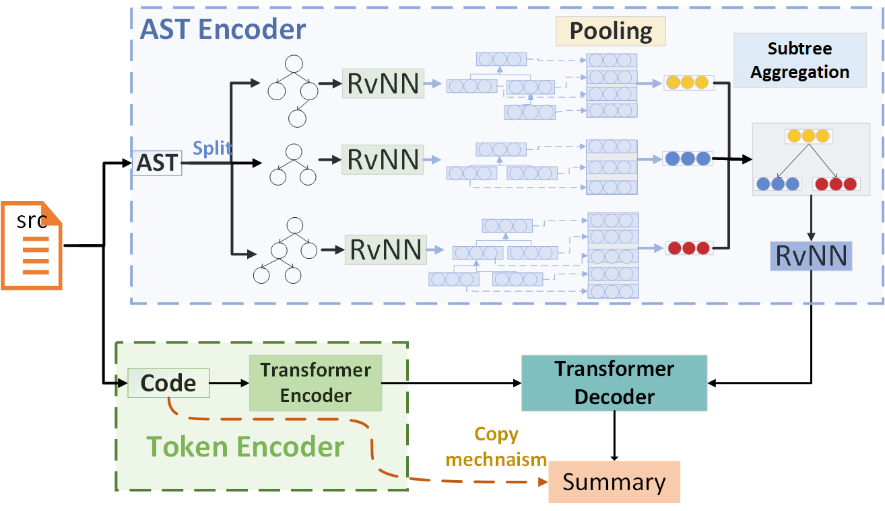

## CASTS: Enhancing Code Summarization with AST Splitting

## Environment

Create an environment and activate it:

    conda create -n  CAST python=3.6 ipykernel -y
    conda activate CAST
	conda install pydot -y
	pip install git+https://github.com/casics/spiral.git
	pip install pandas==1.0.5 gensim==3.5.0 scikit-learn==0.19.1 pycparser==2.18 javalang==0.11.0 tqdm networkx==2.3 nltk==3.4.4 psutil gin-config prettytable
    conda install pytorch torchvision cudatoolkit=10.1 -c pytorch

Install Java 1.8

Install pytorch according to your environment, see https://pytorch.org/ 
you can use `nvcc --version` to check the cuda version. 

## Model

CAST (Code summarization with AST Splitting and reconsTruction) hierarchically splits a large AST into a set of subtrees 
and learns the representation of the complete AST by aggregating its subtrees' representation learned using tree-based neural models.
The architecture of CAST follows the Seq2Seq framework, including three main components, i.e., an AST 
encoder module, a code token encoder module, and a summarization decoder module. 
The AST encoder is responsible for representing the semantic and structural information of splitting AST. 
The code encoder encodes the lexical information of each method.
The decoder integrates the multi-channel representations from the above encoders and incorporates the copy mechanism to generates the final summary.

## Quick Start 

###  Data Preparation 

Download Processed the dataset by:

    $ cd ./Data/
    $ bash get_data.sh
    $ cd ../
or
run python `pipeline.sh` to generate preprocessed small data from scratch.
   
|Dataset|train|valid|test|
| :--------- | :------: | :----: | :----: |
| TL-CodeSum | 66,935   | 8,359  | 8,367  |
| Funcom     | 1,904,093 | 103,650  | 103,487|

More details about AST splitting implementation can refer to [Splitting](Splitting)

###  Training
You can download the trained model by:

    $ bash get_trained_model.sh

The model is saved in `./output/DATASET_NAME/model.pth`.
DATASET_NAME is `TL_CodeSum` or `Funcom`.

You  can also train it from scratch.
`batch size `should be configured based on the GPU memory size by setting `-bs xx`
#### Train in Single GPU

    $ cd ./source_code/
    $ python casts.py  -cf_file "DATASET_NAME.json"  -ddp False
    
for example

    $ python casts.py  -cf_file "TL_CodeSum.json"  -ddp False
    
#### Train in Multi-GPU

Take 4-GPUs for example:

    $ cd ./source_code/
    $ python -m torch.distributed.launch --nproc_per_node=4  --master_addr='localhost' --master_port=23456 casts.py  -cf_file "DATASET_NAME.json" 

note: you can find the output in `./output/DATASET_NAME`. 

###  Testing 

Set `-only_test` is `True` for testing. 
The model is load from `./output/tl_codesum/model.pth`
and the log file and predict result are saved in `./output/tl_codesum/predict.json`

     $ cd ./source_code/
     $ python casts.py  -cf_file "DATASET_NAME.json"  -ddp False -only_test True
     
for example

    $ python casts.py  -cf_file "TL_CodeSum.json"  -ddp False  -only_test True
  
### Evaluation  
     $ cd ./source_code/
     $ python evaluation.py -dataset DATASET_NAME

for example

    $ python evaluation.py -dataset TL_CodeSum
    
### Human evaluation
    
Click [here](human-evaluation/README.md) to see the result of human evaluation
